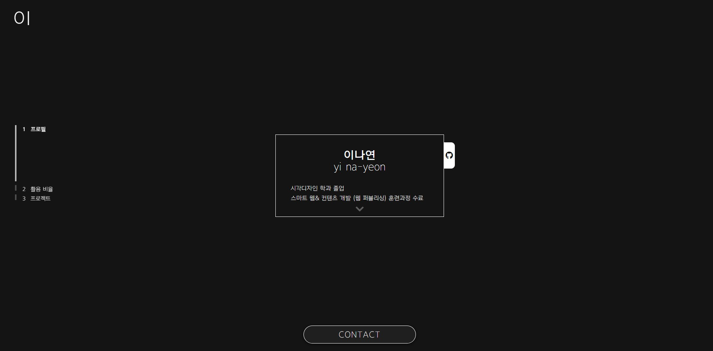

✨ Portfolio 포트폴리오
===========

### 👉 [웹 페이지 보러가기](https://user809-git.github.io/yi-na-yeon/index.html)
** 포트로리오를 위한 사이트   
** 모든 프로젝트 -> 만든 기간 총 5개월

***

## 0. 미리보기 
### 0.1 파일 미리보기 
- 📁 css
  - 📁 font
    - 🅰 (web-font files)
  - 📄 basic.css
  - 📄 stylesheet.css
- 📁 img
  - 📁 fav
  - 📷 (images)
- 📁 js
  - 📄 jquery-3.4.1.min.js
  - 📄 main.js
- 📄 index.html

### 0.1 사이트 미리보기

- 좌측 상단 로고[이] 클릭시> [home]
- 네비게이션 : 왼쪽 중앙(pc) > 우측 상단(mobile)
- 연락처 탭(하단 중앙) 클릭/탭> 연락처 보이기 토글

## 1. 첫 화면 - 프로필
### 1.1 프로필 카드
1. 이름, 간단한 교육/학습 내용
2. 다음 섹션으로 넘어가는 화살표
3. 깃허브로 연결되는 `<a>` 아이콘

## 2. 활용 비율 보기
### 2.1 리스트 탭
- 탭들
  - (Adobe) Photoshop  
  - (Adobe) illustrator
  - HTML5
  - CSS3
  - 반응형 웹
  - JavaScript(ES6+)
  - jQuery
  - JSP
  - Servelet
  - Oracle Database 
* _Internet Explorer에서는 항목들을 탭했을 때 하나씩 표시되지 않고 탭의 배경에 비율만큼 채워져서 보이도록 함_
### 2.2 항목 별 비율 표시 바(bar)
* 배운 언어들 중 활용 빈도 수나 활용가능한 정도를 고려하여 100% 중에 활용 비율을 표시
* _Internet Explorer에서 작동 되지 않음 (비율을 탭에 직접 표시_)

## 3. 프로젝트
### 3.1 포트폴리오 프로젝트들
** _각 페이지/ github 주소로 이동합니다._
1. [Design Samsung](https://user809-git.github.io/portfolio1/index.html)
    - github code: <https://github.com/user809-git/portfolio1>
2. [LEGO korea](https://user809-git.github.io/portfolio2/index.html)
    - github code: <https://github.com/user809-git/portfolio2>
3. [ABOUT_봉준호](https://user809-git.github.io/portfolioA/index.html)
    - github code: <https://github.com/user809-git/portfolioA>
4. [JUMP](https://user809-git.github.io/portfolio3/index.html)
    - github code: <https://github.com/user809-git/portfolio3>

### 3.2
- 포트폴리오 박스를 클릭하면 각각의 페이지로 이동
- 각 박스의 오른쪽 하단 깃허브 아이콘을 클릭/탭하면 github 주소로 이동

